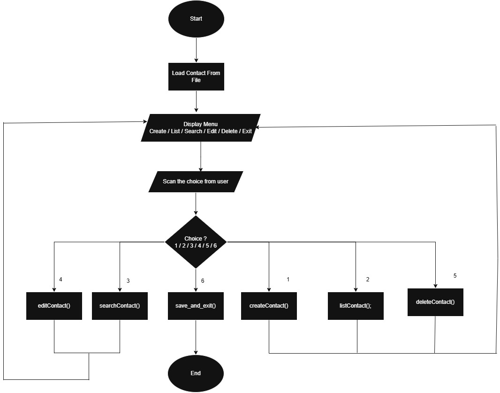
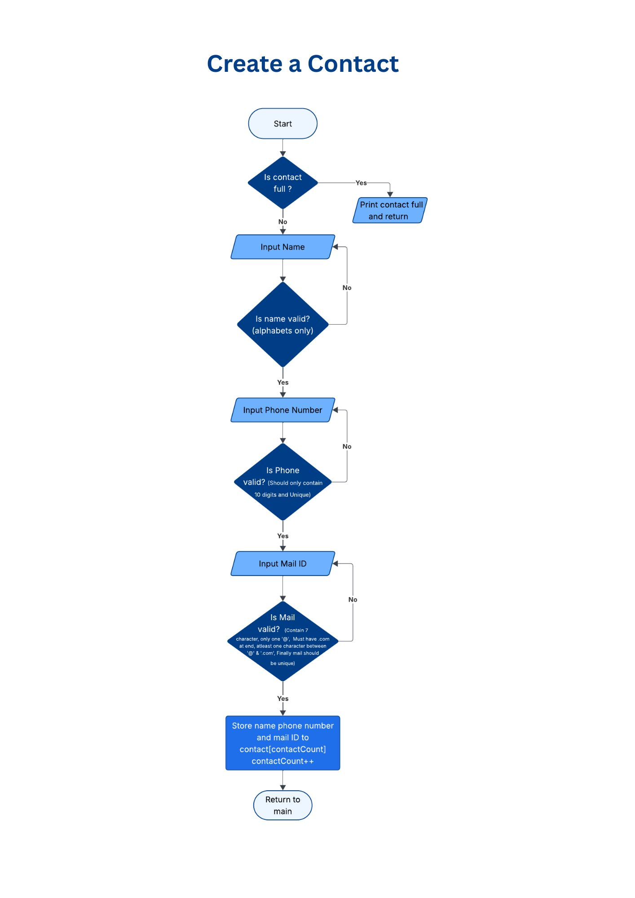
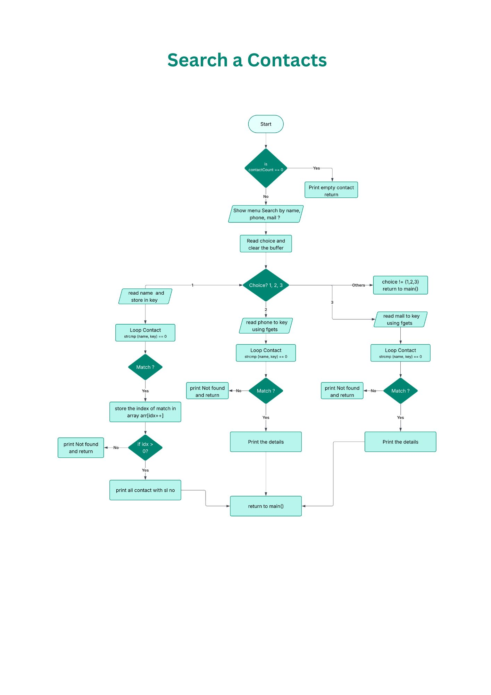
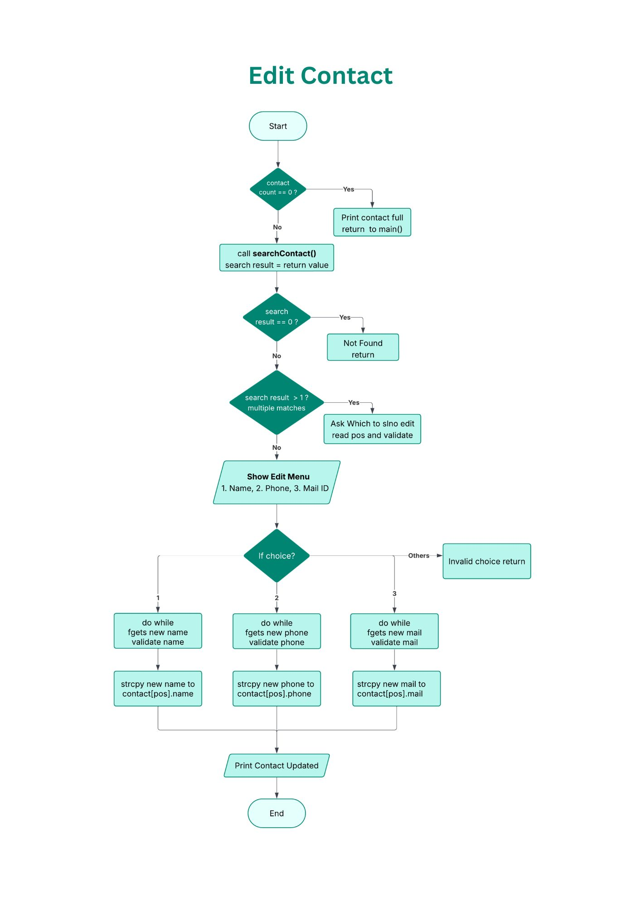
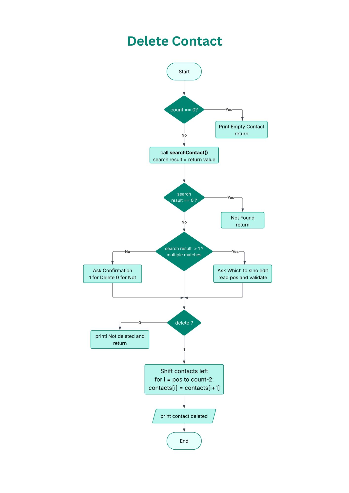

# C Address Book Application 🛠️

A robust, modular console application built in C for managing personal contacts, featuring input validation, modular function design, and data persistence via a CSV database. This project was developed in a Linux environment (WSL).

## 📐 Modular System Architecture

The application is structured into distinct modules for optimal maintainability and readability.

* `address_book.h`: Common struct definitions, constant definitions, and function prototypes.
* `main.c`: The core program control loop and main menu interface.
* `fileStorage.c`: Dedicated functions for loading and saving contact data to `contacts.csv`.
* `contacts.c`: Implements the core backend engine features: Create, Search, Edit, and Delete.

  

## 🚀 Key Operational Flows

These flowcharts visualize the logical progression and modular interactions of the core features.

### ➕ Create Contact Flow
Details the multi-step process for data entry, strict validation (Name/Phone), and duplicate detection before saving in memory.

  

### 🔍 Search Contact Flow
Illustrates the modular search logic, allowing users to find contacts by Name or Phone using `strcmp` iteration.

  

### ✏️ Edit Contact Flow
Maps out how the system reuses the Search logic to pinpoint a contact index and cleanly overwrites specific data fields after strict input re-validation.

  

### ❌ Delete Contact Flow
Demonstrates the memory-safe array deletion logic, using a shift-left algorithm to fill the gap left by the removed record and updating the internal counter.

  

## 💾 CSV Database Layout

Data persistence is managed via a simple, scalable `contacts.csv` file.
